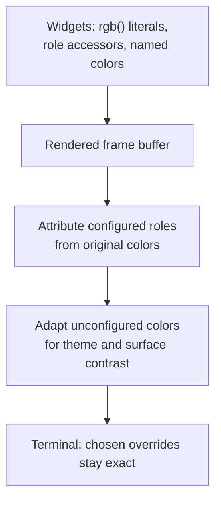

# TUI Colors

Every color the kcode TUI renders is user-configurable.

## The default palette is fixed

kcode's built-in palette is hand-tuned. It stays the default.
`default_palette_is_frozen` in `palette.rs` holds a redundant copy of every value
and fails if any of them change, because the repair pass reads those constants and
it would be easy to "improve" one while tuning. Changing a default changes what
every existing user sees on launch, so it has to be a deliberate edit to that
table.

## Configuring colors

Colors live in `~/.kcode/config.toml`:

```toml
[display.colors]
user = "#8ab4f8"
ai = "#81c784"
accent = "#ba8bff"
error = "#ff6464"
```

Run `/colors` in the TUI to list every role with its current value. Changes
apply immediately; no restart.

| Command | Effect |
| --- | --- |
| `/colors` | List every configurable role |
| `/colors <role> <#rrggbb>` | Set one role (saved to config) |
| `/colors export` | Print the palette as config TOML |
| `/colors reset [role]` | Reset one role, or all of them |

## How every color became configurable

The TUI does not have one palette. It has ~22 named semantic roles plus roughly
250 distinct ad hoc `rgb(...)` literals spread across widgets, plus ratatui's
named colors (`Color::Red`, `Color::White`, ...). Editing every call site would
have been a large, permanently fragile change.

Instead, substitution happens at the single point every color must pass through
to reach the terminal: the rendered frame buffer.



The order matters. The light/dark pass exists because kcode's *built-in* palette
is designed for dark terminals. On light terminals it flips luminance, then
repairs foreground and underline colors to meet a **7:1 enhanced contrast target** on
their cell's adapted background. Default terminal backgrounds use a conservative
off-white reference (`#e0e0e0`), so muted labels stay readable on tinted and
inactive light panes, not only pure white. Panel fills keep their light tints.
Reverse-video cells use their visible foreground/background roles, and the
contrast check includes 256-color quantization. If neither black nor white can
reach 7:1 on an intermediate-tone surface, the best available endpoint is used.
Dark themes are unchanged.

This avoids simple inversion turning muted `#505050` text into washed-out
`#afafaf` text. The default-surface muted ink is now `#474747` instead.

A color the user configured is already the color they want. The combined
`adapt_buffer_for_display` pass matches overrides against the original native
colors, then adapts only colors that were not substituted. Matching must happen
before contrast repair: otherwise different muted grays can converge to the same
readable ink, making `tool`, `dim`, and `pending` overrides indistinguishable.
Explicit overrides remain exact, even if a user deliberately chooses a
low-contrast color. Unconfigured text uses its final surface, including a
configured panel background. Partial animation/spinner redraws use the same order.

Three consequences worth knowing:

- **Role accessors return defaults.** `theme::user_color()` deliberately returns
  the role's *default* color, not the configured one. If it returned the
  configured color, a cell would be remapped twice (once by the accessor, once
  by the buffer pass) and the hue/lightness offsets would compound.
- **Only role-tagged colors are configurable.** A buffer color that *is* a
  role's default is replaced by that role's configured color, and ratatui's
  named colors map to the role they conventionally stand for. An ad hoc
  `rgb(...)` literal carries no role, so recoloring a role leaves it alone: give
  a shade a role if it should follow `/colors`. There is no guessing by color
  proximity, so an override can never bleed into another role's output.

- **Configured colors are used exactly as given**, on light and dark terminals
  alike, so what you put in the config is what the terminal receives.

An unconfigured palette is a byte-identical no-op, guarded by tests, so existing
users see no change.

### Which colors are configurable?

Every role, plus every ratatui named color the TUI uses. Named colors are mapped
explicitly and a test requires each used one to map to a role; `Color::Reset` is
never substituted, since it is how the terminal's own background shows through.
`palette_literals.rs` is a corpus for the light-contrast tests, not a
configurability claim; regenerate it when adding widgets with new shades.

## Adding a role

1. Add the variant to `Role` in `crates/jcode-tui-style/src/palette.rs`, list it
   in `ALL_ROLES`, and give it a `key()` and a `default_rgb()` equal to the value
   currently hard-coded at its call sites. Defaults must preserve today's look.
2. If it is a background, say so in `is_background()`; backgrounds are graded on
   different readability criteria than text.
3. If it must be distinguishable from another role, that is a style choice; the
   shipped palette keeps `dim`/`tool` similar on purpose.
4. Add an accessor in `theme.rs` and use it at the call sites.

`ALL_ROLES` drives the `/colors` listing, completions, and export, so a new role is
automatically covered by all of them.
