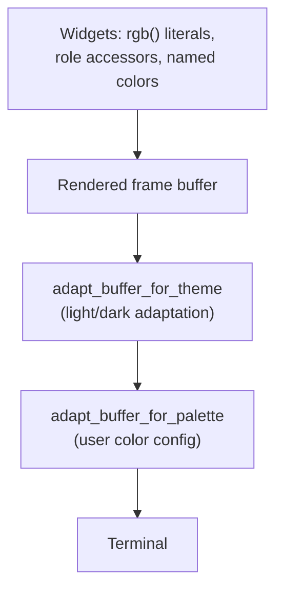

# TUI Colors and Palette Harmony

Every color the jcode TUI renders is user-configurable, and palettes can be
measured objectively rather than eyeballed.

## The default palette is fixed

jcode's built-in palette is hand-tuned and is **not** derived from the harmony
metric. It stays the default. `default_palette_is_frozen` in `palette.rs` holds a
redundant copy of every value and fails if any of them change, because the
generator, scorer, and repair pass all read those constants and it would be easy
to "improve" one while tuning the tooling. Changing a default changes what every
existing user sees on launch, so it has to be a deliberate edit to that table.

A low harmony score on the default palette is not a reason to change it. The
metric is there to help users evaluate palettes *they* choose, and to let
`/colors generate` build one on request.

## Configuring colors

Colors live in `~/.jcode/config.toml`:

```toml
[display.colors]
user = "#8ab4f8"
ai = "#81c784"
accent = "#ba8bff"
error = "#ff6464"
```

Run `/colors` in the TUI to list every role with its current value. Changes
apply immediately; no restart.

| Command | Effect |
| --- | --- |
| `/colors` | List every configurable role |
| `/colors <role> <#rrggbb>` | Set one role (saved to config) |
| `/colors generate <#rrggbb>` | Derive a whole harmonious palette from one seed |
| `/colors harmony` | Score the palette and list specific fixes |
| `/colors export` | Print the palette as config TOML |
| `/colors reset [role]` | Reset one role, or all of them |

## How every color became configurable

The TUI does not have one palette. It has ~22 named semantic roles plus roughly
250 distinct ad hoc `rgb(...)` literals spread across widgets, plus ratatui's
named colors (`Color::Red`, `Color::White`, ...). Editing every call site would
have been a large, permanently fragile change.

Instead, substitution happens at the single point every color must pass through
to reach the terminal: the rendered frame buffer.



The order matters. The light/dark pass exists because jcode's *built-in* palette
is designed for dark terminals, so it flips luminance to make those colors work
on light ones. A color the user configured is already the color they want, so it
runs last and is never flipped: otherwise a deliberately dark red for errors on a
white terminal would come out an unreadable pale pink. Because incoming literals
have already been flipped by then, role defaults are pre-flipped the same way
before matching.

Three consequences worth knowing:

- **Role accessors return defaults.** `theme::user_color()` deliberately returns
  the role's *default* color, not the configured one. If it returned the
  configured color, a cell would be remapped twice (once by the accessor, once
  by the buffer pass) and the hue/lightness offsets would compound.
- **Ad hoc literals follow their role.** A literal within a small perceptual
  radius of a role's default is re-expressed relative to the new role color,
  preserving its own lightness and chroma offset. So a "slightly dimmer variant
  of the warning color" stays a slightly dimmer variant after you recolor
  `warning`. Literals far from every configured role are left alone.

- **Configured colors are used exactly as given**, on light and dark terminals
  alike, so what you put in the config is what the terminal receives.

An unconfigured palette is a byte-identical no-op, guarded by tests, so existing
users see no change.

### Is it really *every* color?

That claim is checked rather than asserted. `palette_literals.rs` holds every
distinct `rgb(...)` literal the TUI crates render (222 of them), and a test
requires **all** of them to be reachable from some role: an unclaimed literal is
a color a user cannot change. A second test requires every one of the 22 roles to
claim at least one real literal (so no role is dead weight in `/colors`) and none
to claim more than half (so the family radius still tells roles apart). The
current spread runs from 2 literals (`header_session`) to 28 (`warning`).

Ratatui's named colors are covered separately, since they carry no RGB for
literal matching to work with. A test enumerates every named color the TUI
actually uses and requires each to map to a role. `Color::Black` was unreachable
until that test existed. `Color::Reset` is deliberately never substituted: it is
how the terminal's own background shows through.

Regenerate `palette_literals.rs` when adding widgets that introduce new shades.

## Measuring harmony

`/colors harmony` scores a palette 0-100 across five criteria and reports the
specific offenders. All math is in Oklab, a perceptually uniform space, so
"distance" and "lightness" match what the eye reports rather than what the RGB
numbers suggest.

| Criterion | Weight | Critical | What it measures |
| --- | --- | --- | --- |
| readability | 3.0 | yes | Lightness contrast of each foreground role against the real terminal background |
| distinctness | 2.0 | yes | Perceptual distance between roles that must never be confused (`success`/`error`, `user`/`ai`, ...) |
| hue harmony | 2.0 | no | Fit to a recognized scheme (analogous, complementary, triadic, tetradic, split-complementary) |
| chroma coherence | 1.5 | yes | Saturation consistency, plus whether the palette sits in a comfortable-reading saturation band |
| colorblind safety | 1.0 | no | Distinctness re-measured under simulated deuteranopia and protanopia |

Two design decisions matter here:

**Only critical criteria can sink the score.** The overall score blends the
weighted mean with the *worst critical* criterion. Unreadable text is a defect.
An unconventional hue scheme is a style choice: Solarized deliberately breaks
textbook hue rules and is still one of the most loved palettes ever made.
Treating taste as a defect made the metric disagree with its own users.

**Aggregation is worst-weighted.** Within a criterion, the score is
`0.4 * mean + 0.6 * worst`, so one unreadable role or one colliding pair cannot
hide behind twenty fine ones. That single broken thing is exactly what the user
wants to hear about.

### Calibration

A harmony score is only useful if it agrees with human judgement, so the test
suite pins that agreement against palettes thousands of developers chose on
purpose. Current scores on a dark background:

| Palette | Score |
| --- | --- |
| Dracula | 76 |
| Solarized Dark | 70 |
| Nord | 69 |
| Gruvbox Dark | 67 |
| Neon chaos (hostile) | 56 |
| Unreadable mud (hostile) | 38 |

If a scoring change inverts any of these orderings, the metric has drifted away
from what people mean by "harmonious" and the change is wrong. Calibrating
against real palettes caught three genuine miscalibrations that a
self-consistent test suite would have happily accepted forever.

## Generating a palette

Hand-tuning 22 roles is what stops most people from theming at all, so
`/colors generate <#rrggbb>` derives a complete palette from one seed color and
reports the resulting score.

- Roles are placed on the seed's hue wheel in a split-complementary layout.
- Chroma is pulled into the comfortable-reading band, so even a neon seed yields
  a usable palette.
- Lightness targets the *active* terminal background, because a palette tuned
  for dark is usually wrong on light.
- `success`, `warning`, and `error` keep their conventional hues. Users depend on
  red meaning error far more than they value novelty.
- Must-distinguish pairs are separated by **lightness as well as hue**. Under
  red-green color vision deficiency, hue separation largely collapses onto a
  blue-yellow axis while lightness survives every type, which is why accessible
  palettes lean on lightness. `success`, `warning`, and `error` are placed on
  three distinct lightness levels for exactly this reason: green, amber, and red
  all project toward yellow under deuteranopia, so hue cannot separate them at
  all there.
- A **repair pass** then fixes any pair still confusable, scoring candidate moves
  by the palette's *global* weakest pair. This matters more than it sounds: the
  constraints are coupled (success, warning, and error form a triangle), so
  greedy pairwise repair provably cycles, and a trace confirmed it did, fixing
  one edge by breaking another until the iteration budget ran out. Candidates are
  bounded to keep contrast, chroma, and the conventional hues intact, so the pass
  can never buy distinctness by making a role unreadable or colorless.

Both limits are honest ones. Within the readable lightness band and the hue
budget that keeps red meaning error, an amber warning and a red error cannot be
pushed past ~0.7 of the distinctness target under protanopia. Going further would
require giving up either contrast or the semantic convention, and both cost the
user more than the extra margin buys.

Tests hold the generator to the metric itself: every seed, including pure red,
pure gray, and near-black, must score at least 70 on both light and dark
backgrounds.

## Adding a role

1. Add the variant to `Role` in `crates/jcode-tui-style/src/palette.rs`, list it
   in `ALL_ROLES`, and give it a `key()` and a `default_rgb()` equal to the value
   currently hard-coded at its call sites. Defaults must preserve today's look.
2. If it is a background, say so in `is_background()`; backgrounds are graded on
   different readability criteria than text.
3. If it must be distinguishable from another role, add the pair to
   `MUST_DISTINGUISH` in `harmony.rs`. Do not add pairs that good palettes
   legitimately make similar (`dim`/`tool` are both low-emphasis grays in nearly
   every real palette).
4. Add an accessor in `theme.rs` and use it at the call sites.

`ALL_ROLES` drives the `/colors` listing, completions, export, and harmony
analysis, so a new role is automatically covered by all of them.
